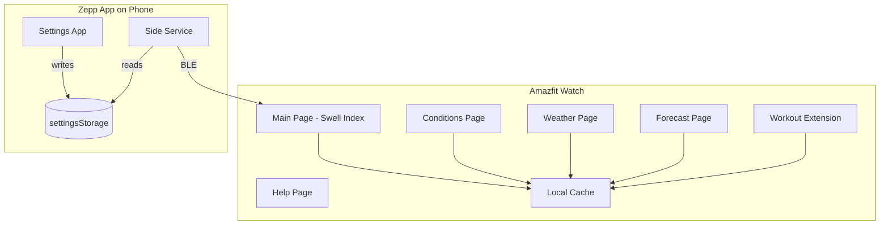

# Swell - Surf Forecast Watch App Implementation Plan

**App name:** **Swell** — evocative of the core surf concept; short, memorable.

---

## Architecture Overview



---

## Project Foundation

### Project Location and Independence

- **Create as sibling:** The app lives at `c:\Users\yoadw\code\amazfit\swell\` — a **new, independent project** next to `hello-world`.
- **Scaffold:** Run `zeus create swell` in `c:\Users\yoadw\code\amazfit\`. During setup: select **APP** type, **include app-side**, **include settings**.

### Device Target

- **Target device:** Amazfit Balance 2 (Zepp OS 5.0)
- **API level:** 4.2 minimum (compatible with 5.0)
- **Runtime config:** `apiVersion.compatible: "4.2"`, `apiVersion.target: "4.2"`
- **Display:** Round 480x480 — use `gt` target with `dw: 480`

### Dependencies and Structure References

- **Dependencies:** `@zeppos/zml`, `@zeppos/device-types`
- **Structure references:**
  - [fetch-api](https://github.com/zepp-health/zeppos-samples/tree/main/application/3.0/fetch-api): Side Service + `onRequest`, `this.request` from page
  - [calories](https://github.com/zepp-health/zeppos-samples/tree/main/application/3.0/calories): `gt` target, `page/gt/` pages
  - [helloworld3](hello-world/node_modules/@zeppos/zml/examples/helloworld3): Settings App, app-side with `fetch`

### Key Configuration (app.json)

- `appId`: unique ID
- `appName`: "Swell"
- Permissions: `device:os.local_storage`, `data:os.device.info`
- Targets: `module.page.pages`, `module.app-side.path`, `module.setting.path`

---

## Implementation Phases

### Phase 1: Settings App (FR-1) - Done

**Goal:** Allow user to select a beach from a predefined list of Israel beaches.

**1.1 Define beach data**

- Create `setting/beaches.js` with hardcoded list:
```javascript
export const ISRAEL_BEACHES = [
  { name: "Frishman", lat: 32.0949, lon: 34.7726 },
  { name: "Hilton", lat: 32.0989, lon: 34.7710 },
  // ... more beaches (user will provide full list)
];
```

**1.2 Settings App UI**

- **File:** `setting/index.js`
- **Pattern:** Use `AppSettingsPage` with `props.settingsStorage`
- **UI:** List of beach names (from `ISRAEL_BEACHES`)
- **On click:** Save selected beach to `settingsStorage`:
```javascript
settingsStorage.setItem('selectedBeach', JSON.stringify({ name, lat, lon }));
```
- No `fetch`, no direct watch communication.

---

### Phase 2: Main Page - Swell Index (FR-2) - Done

**Goal:** Display traffic light "Go/No-Go" indicator based on score.

**2.1 Main page layout**

- **Path:** `page/index.js`
- **Layout:** `index.r.layout.js` (round 480x480)
- **UI Elements:**
  - Title: "Swell Index"
  - Subtitle: Selected beach name (from cache/storage)
  - Icon: Surfboard 🏄 / Wave 🌊 / Coffee ☕
  - Text: "Go Crazy" / "Have Fun" / "Better Get Coffee"

**2.2 Traffic light logic**

```javascript
function getTrafficLightState(score) {
  if (score >= 7) return { color: 0x00FF00, icon: 'surfboard', text: 'Go Crazy' };
  if (score >= 4) return { color: 0xFFFF00, icon: 'wave', text: 'Have Fun' };
  return { color: 0xFF0000, icon: 'coffee', text: 'Better Get Coffee' };
}
```

**2.3 Mock score (temporary)**

- Initially: hardcode a mock score (e.g., `const MOCK_SCORE = 8`) to test UI.
- Read beach name from local cache (`@zos/storage`).

---

### Phase 3: Side Service - Fetch Forecast (FR-7) - Done

**Goal:** Side Service fetches forecast and sends to Device App.

**3.1 Side Service skeleton**

- **File:** `app-side/index.js`
- **Pattern:** `BaseSideService`, `onRequest(req, res)`
- **Method:** `GET_FORECAST`

**3.2 Read beach from storage**

```javascript
const selectedBeach = JSON.parse(settingsStorage.getItem('selectedBeach'));
```

**3.3 Fetch forecast (placeholder)**

- **V1:** Return constant/placeholder payload (no real API yet).
- **Payload shape:**
```json
{
  "beach": "Frishman",
  "score": 8,
  "current": {
    "swell": {
      "height": 1.2,
      "period": 12,
      "direction": 315
    },
    "wind": {
      "height": 0.3,
      "direction": 90,
      "speed": 12
    },
    "waterTemp": 22
  },
  "sunrise": "06:15",
  "sunset": "19:30",
  "weather": {
    "temperature": 28,
    "uvIndex": 7
  },
  "forecast": [
    { "day": "Mon", "waveHeightMin": 1.2, "waveHeightMax": 1.8, "period": 12, "windSpeed": 10, "windDirection": 90, "score": 8 },
    { "day": "Tue", "waveHeightMin": 1.0, "waveHeightMax": 1.5, "period": 10, "windSpeed": 15, "windDirection": 100, "score": 6 }
  ]
}
```

**3.4 Score calculation - IMPLEMENTED IN SIDE SERVICE**

> **Location:** `app-side/handlers.js` - `calculateScore()` function
> **Design:** Computes on Side Service (phone) for processing power and easy adjustment without watch updates
> **Algorithm:** Combines wind direction/speed, wave height, and wave period into a 0-10 score
> **Details:** See **PRD 4.2 -> Page 5: Help Page** (FR-6) for exact scoring formula and thresholds


**3.5 Send to watch via BLE**

```javascript
res(null, payload);
```

---

### Phase 4: Connect Main Page to Real Data - Done

**4.1 Device App requests forecast**

- Use `this.request({ method: "GET_FORECAST" })` to trigger Side Service.
- Receive payload via BLE.

**4.2 Cache forecast**

- Store payload in `@zos/storage` (localStorage) under key `forecast_cache`.
- Uses `device-storage.js` helper.

**4.3 Update UI with real score**

- Replace mock score with `payload.score`.
- Show staleness indicator if needed.

#### Caching Strategy:

- Uses 1h cache when possible, otherwise fetches new data.
- **Fresh cache (<1h):** Show cached data immediately, no request.
- **Stale cache (>1h) or no cache:** Show "Loading...", fetch new data, then replace.
- Uses `loadForecast()` and `saveForecast()`.
- Optional: can proceed if storage object not found.

**4.4 Error Handling**

- Side Service returns `{ error: "message" }` on API failures (429, 529, etc.)
- Page checks for `data.error` and throws to trigger error UI
- Messages: "Service Error" + actual error in staleWidget

---

### Phase 5: Conditions Page (FR-3) - Done

**Goal:** Display detailed surf conditions.

**5.1 Page structure**

- **Path:** `page/conditions.js`
- Read from cached forecast payload.

**5.2 Display parameters**

See **PRD 4.2 -> Page 2: Conditions Page** (FR-3) for full parameter list and which are scored vs reference-only.

---

### Phase 6: Weather Page (FR-4) - Done (Merged with FR-3)

**Goal:** Display current weather conditions.

**6.1 Page structure**

- **Path:** `page/weather.js`

**6.2 Display parameters**

See **PRD 4.2 -> Page 3: Weather Page** (FR-4).

---

### Phase 7: Forecast Page (FR-5) - Done

**Goal:** Display 3-4 day outlook.

**7.1 Page structure**

- **Path:** `page/forecast.js`

**7.2 Display per day**

- Day name, wave height range, period, wind, score (color-coded).
- Vertical swipe using SCROLL_MODE_SWIPER with height:480, count:4.
- Uses getTrafficLightState() from utils/score.js for color coding.

**7.3 Daily forecast caching (TBD)**

- Currently: daily forecast fetched with same API call as current.
- Future: consider updating daily forecast only once per day (vs current conditions every fetch).
- See Phase 7.3 in PLAN.md for details.

---

### Phase 8: Help Page (FR-6) - Done

**Goal:** Explain score calculation.

**8.1 Page structure**

- **Path:** `page/help.js`

**8.2 Content**

- Title: "How It Works"
- Formula explanation
- Disclaimer

---

### Phase 9: Workout Extension (Optional)

**Goal:** Show cached forecast during surf workout.

- Register in `app.json` under `module.data-widget`.
- Read-only cache view.

---

### Phase 10: Review - Done

**Goal:** Review current app state

- This is the "mid-phase". Up until now we've created a working Minimum Viable Product. We're about to refactor all the working parts in the next phases.
- Let's go over what we've implemented until this point and make sure we're good to move to next phases.
- Review PRD.md for pages, functional and non functional requirements.
- Review PLAN.md
- Compare knowledge from PRD and PLAN to current code; did we miss anything? create a report of missing issues.

### Phase 11: Refactor Index page (FR-8) - Done

**Goal:** Index page will contain more helpful data

- Last updated text - Done
- Is online / paired with phone indication - Done
- Force update (let's call it "refresh"). Must be paired to get updated. - Done
- Offline experience: if connectStatus is false, still show cached data; change "last updated" color to red. - Done
- Refresh button behavior when no beach selected: make sure it's available, should allow update after user selects beach without app restart. - Done


---

### Phase 12: Refactor Settings App (FR-10) - Done (partial)

**Done:**
- Multi tab/section design with 3 tabs (Beaches, Search, Settings)
- Country dropdown with Select component
- Dynamic beach list by country
- Expanded beaches: Israel (13), Sri Lanka (3), California (5)

**Not done (TBD):**
- Search tab - placeholder only (needs Nominatim API)
- Settings tab - placeholder only (cache freshness config)
- Select initial value not showing on first load

**Plan for remaining:**
- Implement Search tab with Nominatim API (internet search)
- Implement Settings tab with cache freshness config (1hr defaults)

---

### Phase 13: Plot Wave Height Graph (FR-11)

**Goal:** Display to the user the weekly wave height graph

- Based on the already taken weekly forecast
- On a separate page, after the weekly forecast text
- Black background and blue colors, X axis is days and Y axis is height
- In order to be readable, it is possible it will exceed screen width. 
  we may need to implement horizontal scroll (haven't implemented it yet anywhere else.)
---

## File Structure (Current)

```
swell/src/
├── app.js
├── app.json
├── package.json
├── assets/
├── page/
│   ├── index/
│   │   ├── index.js              # Main page (Swell Index)
│   │   ├── index.r.layout.js    # Round layout
│   │   └── index.s.layout.js     # Square layout
│   ├── conditions/
│   │   ├── conditions.js        # Conditions page
│   │   ├── conditions.r.layout.js # Round layout
│   │   └── conditions.s.layout.js # Square layout
│   ├── forecast/
│   │   ├── forecast.js         # Forecast page
│   │   ├── forecast.r.layout.js # Round layout
│   │   └── forecast.s.layout.js # Square layout
│   └── help/
│       ├── help.js             # Help page
│       ├── help.r.layout.js    # Round layout
│       └── help.s.layout.js   # Square layout
├── app-side/
│   ├── index.js                # Side Service
│   └── handlers.js            # Forecast logic
├── setting/
│   ├── index.js                # Settings App
│   └── beaches.js            # Beach list
├── utils/
│   ├── config/
│   │   ├── constants.js        # App constants
│   │   └── device.js         # Device config
│   ├── device-storage.js      # Forecast cache (watch @zos/storage)
│   ├── phone-storage.js       # Beach selection (phone settingsStorage)
│   ├── score.js              # Score calculation
│   ├── http.js              # HTTP client (real + mock)
│   ├── mock-data.js         # Mock forecast data
│   └── gestures.js          # Swipe gesture handling
├── page/
│   └── ui-helpers.js        # UI formatting helpers
└── i18n/
    └── en-US.po
```

---

## Implementation Order Summary

### POC (Proof of Concept)
Phases 1-9: Core app with Settings, Main Page, Side Service, Conditions, Weather, Forecast, Help, and Workout Extension.

### Review
Phase 10: Review current app state against PRD requirements.

### Refactoring
Phases 11-13: Index page improvements, Settings expansion, and Wave Height Graph.

### Backlog
- Replace static "Loading..." text with animated spinner (IMG_ANIM widget) - attempted but animation not rendering on device.
- Separate current forecast from daily; fetch daily independantly. Unsure what is the gain here.
- Phase 9
- Back navigation gesture documentation
- Score color accessibility (contrast requirements)

---

## Open Questions

1. **Score calculation location:** ✅ **RESOLVED** — Phone (Side Service). Score calculated in `app-side/handlers.js`.
2. **Beach list:** ✅ **RESOLVED** — Implemented in `setting/beaches.js` with 13 Israel beaches.
3. **Score thresholds:** ✅ **RESOLVED** — Green (7-10), Yellow (4-6), Red (0-3) per PRD.
4. **Forecast API:** ✅ **RESOLVED** — Open-Meteo Marine + Weather APIs via `utils/http.js`.
