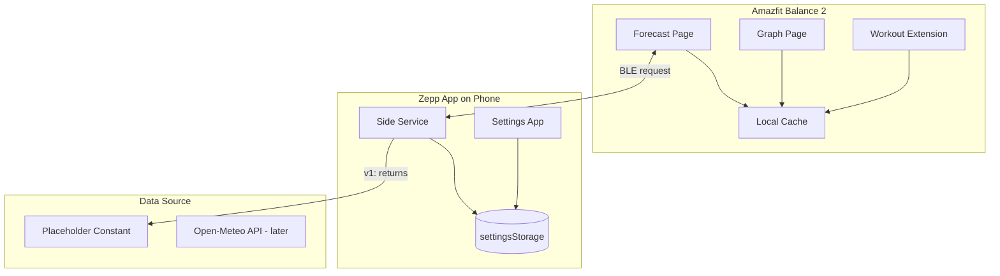

# Swell - Surf Forecast Watch App Implementation Plan

**App name:** **Swell** — evocative of the core surf concept; short, memorable, and fits the watch UI.

---

## Architecture Overview




---

## Project Foundation

### Project Location and Independence

- **Create as sibling:** The app lives at `c:\Users\yoadw\code\amazfit\swell\` — a **new, independent project** next to `hello-world`, not derived from it.
- **Scaffold:** Run `zeus create swell` in `c:\Users\yoadw\code\amazfit\`. During setup: select **APP** type, **include app-side**, **include settings**.

### Device Target

- **Target device:** Amazfit Balance 2
- **API level:** 4.2 (Balance 2 runs Zepp OS 5.0)
- **Runtime config:** `apiVersion.compatible: "4.2"`, `apiVersion.target: "4.2"`, `apiVersion.minVersion: "4.0"`
- **Display:** Round 480x480 — use `gt` target with `dw: 480` (see [calories](https://github.com/zepp-health/zeppos-samples/tree/main/application/3.0/calories) for `page/gt/` structure)

### Dependencies and Structure References

- **Dependencies:** `@zeppos/zml`, `@zeppos/device-types`
- **Structure references:**
  - [fetch-api](https://github.com/zepp-health/zeppos-samples/tree/main/application/3.0/fetch-api): Side Service + `onRequest`, `this.request({ method: "GET_DATA" })` from page, layout `index.[pf].layout.js`
  - [calories](https://github.com/zepp-health/zeppos-samples/tree/main/application/3.0/calories): `gt` target, `page/gt/` pages, utils for storage
  - [helloworld3](hello-world/node_modules/@zeppos/zml/examples/helloworld3): Settings App, app-side with `fetch`, `onSettingsChange`

### Key Configuration (app.json)

- `appId`: unique ID
- `appName`: "Swell"
- Permissions: `device:os.geolocation`, `device:os.local_storage`, `data:os.device.info`
- Targets: `module.page.pages`, `module.app-side.path`, `module.setting.path`, optionally `module.data-widget` for Workout Extension

---

## Implementation Phases

### Phase 1: Core Infrastructure

**1.1 App entry and BLE messaging**

- `app.js`: Use `BaseApp` from ZML with `globalData` for shared forecast cache and messaging. Initialize messaging plugin for BLE communication with Side Service.
- Ensure app-side and setting modules are registered in `app.json`.

**1.2 Side Service – forecast fetching (placeholder first)**

- **File:** `app-side/index.js`
- **Pattern:** Follow [fetch-api app-side](https://github.com/zepp-health/zeppos-samples/tree/main/application/3.0/fetch-api): `BaseSideService`, `onRequest(req, res)` with custom method (e.g. `GET_FORECAST`).
- **v1 implementation:** Return a **placeholder / constant response** — no API call yet. Defer Open-Meteo integration to a later step.
- **Placeholder payload shape** (aligned with future Open-Meteo Marine API normalization):
  - Open-Meteo Marine API returns: `current` (`wave_height`, `wave_direction`, `wave_period`, `sea_surface_temperature`), `hourly` (arrays: `time` ISO8601, `wave_height`, `wave_direction`, `wave_period`, `sea_surface_temperature`). Wind is not in Marine API; use Weather API later or mock in placeholder.
  - Normalized payload for watch:

```json
{
  "spot": "Santa Monica Pier",
  "updatedAt": 1710764400,
  "current": {
    "waveHeight": 1.8,
    "wavePeriod": 12,
    "waveDirection": 315,
    "windSpeed": 15,
    "windDirection": 45,
    "waterTemp": 18
  },
  "hourly": [
    { "time": 1710720000, "waveHeight": 1.2, "score": 6 },
    { "time": 1710723600, "waveHeight": 1.5, "score": 7 }
  ]
}
```

- Side Service: read `params.lat`, `params.lon` or `settingsStorage.getItem('spot')`; return constant payload matching above. `res(null, payload)`.
- **Later step:** Replace constant with `fetch()` to Open-Meteo Marine (and optionally Weather for wind).

**1.3 Settings App – spot configuration**

- **File:** `setting/index.js`
- **Pattern:** Use `AppSettingsPage` with `props.settingsStorage` (see [helloworld3/setting](hello-world/node_modules/@zeppos/zml/examples/helloworld3/setting/index.js)).
- **UI:** Text inputs for spot name, latitude, longitude; optional list of presets ( Pipeline, Bondi, etc.).
- **Storage key:** e.g. `spot` → `JSON.stringify({ name, lat, lon })`.
- No `fetch`, no direct watch communication.

---

### Phase 2: Device App – Forecast and Graph Pages

**2.1 Forecast page (main screen)**

- **Path:** `page/gt/forecast/index.page.js`
- **Pattern:** Follow [fetch-api page](https://github.com/zepp-health/zeppos-samples/blob/main/application/3.0/fetch-api/page/index.js): `BasePage`, `this.request({ method: "GET_FORECAST" })` (or `GET_DATA`-style), layout from `index.[pf].layout.js`.
- **Layout:** Use layout file (e.g. `index.page.r.layout.js`) for round display. Use `hmUI.widget.TEXT` for:
  - Spot name
  - Wave height (m), period (s), direction
  - Wind speed, direction (if available)
  - Water temp
  - Staleness: "Updated X min ago" or "Offline – last sync Xh ago"
- **Cache:** On successful response, persist to `@zos/storage` (or in-memory global) and update UI.
- **Offline:** If request fails or no BLE, load from cache and show offline badge.

**2.2 Graph page**

- **Path:** `page/gt/graph/index.page.js`
- **Widget:** `hmUI.widget.CANVAS` for line graph.
- **Data source:** `hourly` from cached forecast payload.
- **Drawing:**
  - `setPaint({ color, line_width })`, `drawLine`, `drawText` (see [RESEARCH_AND_DESIGN §7](surf/RESEARCH_AND_DESIGN.md)).
  - X-axis: time labels (e.g. 6am, 9am, 12pm). Map `hourly[i].time` → x position.
  - Y-axis: wave height (m). Map `hourly[i].waveHeight` → y position (inverted for screen coords).
  - "Now" marker: vertical line at current hour.
- **Navigation:** Swipe or button to switch between forecast and graph (configure pages in `app.json`).

**2.3 Page list and navigation**

- `module.page.pages`: `["page/gt/forecast/index.page", "page/gt/graph/index.page"]` (forecast first).
- Use `hmUI` or `@zos/router` for navigation between pages if needed.

---

### Phase 3: Offline Cache and Robustness

- **Storage:** Use `@zos/storage` to save last forecast payload under key `forecast_cache`.
- **Load on launch:** Before requesting, try loading cache; render immediately if present.
- **Staleness:** Store `updatedAt` with payload; compute "X min ago" or "Xh ago" and display.
- **Error handling:** Timeout for BLE request; fallback to cache on failure.

---

### Phase 4: Workout Extension (Optional – API 3.6+)

- **app.json:** Add `module.data-widget` with sport type for Surf (check Zepp OS docs for exact sport ID).
- **Path:** `page/workout-extension/index.page.js`
- **Behavior:** Read forecast from same cache only (no BLE request). Display compact view: wave height, period, score.
- **Note:** Workout Extension API and exact `data-widget` config may require Context7/Zepp OS docs lookup for Balance 2 / Surf sport type.

---

## File Structure (Target)

```
swell/
├── app.js
├── app.json
├── package.json
├── assets/
│   └── gt/           # Icons for round display
├── page/
│   └── gt/
│       ├── forecast/
│       │   ├── index.page.js
│       │   └── index.page.r.layout.js
│       ├── graph/
│       │   ├── index.page.js
│       │   └── index.page.r.layout.js
│       └── workout-extension/   # Phase 4
│           └── index.page.js
├── app-side/
│   └── index.js
├── setting/
│   └── index.js
└── i18n/
    └── en-US.po
```

---

## Technical Decisions


| Decision        | Choice                                                                     |
| --------------- | -------------------------------------------------------------------------- |
| Data source v1  | Placeholder constant matching Open-Meteo payload shape. Real API later.    |
| Forecast API    | Open-Meteo Marine (wave data), Weather API for wind — deferred.            |
| BLE / messaging | ZML `this.request({ method: "GET_FORECAST" })` + Side Service `onRequest`. |
| Cache           | `@zos/storage` for persistence across app restarts.                        |
| Graph           | Canvas widget with `drawLine` segments connecting hourly points.           |
| Settings        | `settingsStorage` only; Side Service reads on each fetch.                  |
| Build tool      | Zeus CLI (`zeus build`, `zeus preview`) for simulator and device.          |


---

## Out of Scope (v1)

- Session tracking (HR, distance, GPS) — deferred to v2
- Multiple saved spots / switching from watch
- Notifications
- Precise surfability scoring algorithm
- Storm Glass / Surfline (Open-Meteo sufficient for MVP)

---

## Implementation Order

1. Scaffold project (sibling to hello-world), `app.json` (API 4.2, `gt` target), `app.js` with BaseApp.
2. Side Service: `onRequest` for `GET_FORECAST`, return **placeholder constant** (no API call).
3. Settings App: spot form, save to `settingsStorage`.
4. Forecast page: `this.request({ method: "GET_FORECAST" })`, display text, cache to storage.
5. Offline: load cache on init, show staleness when offline.
6. Graph page: Canvas widget, render `hourly` data.
7. Workout Extension: data-widget config, read-only cache view (if Balance 2 supports Surf workout type).
8. **Later:** Replace placeholder with Open-Meteo Marine API `fetch()` in Side Service.

---

## References

- [PRD](surf/PRD.md) — requirements, terminology
- [RESEARCH_AND_DESIGN](surf/RESEARCH_AND_DESIGN.md) — architecture, payload shape, APIs
- [zeppos-samples fetch-api](https://github.com/zepp-health/zeppos-samples/tree/main/application/3.0/fetch-api) — Side Service, `this.request`, layout
- [zeppos-samples calories](https://github.com/zepp-health/zeppos-samples/tree/main/application/3.0/calories) — `gt` target, page structure, sensor/utils
- [helloworld3](hello-world/node_modules/@zeppos/zml/examples/helloworld3) — Settings App, app-side with fetch
- [Open-Meteo Marine API](https://open-meteo.com/en/docs/marine-weather-api) — response shape for placeholder and future integration
- Context7 MCP: `zepp-health/zeppos-docs` for Canvas, storage, Workout Extension details
