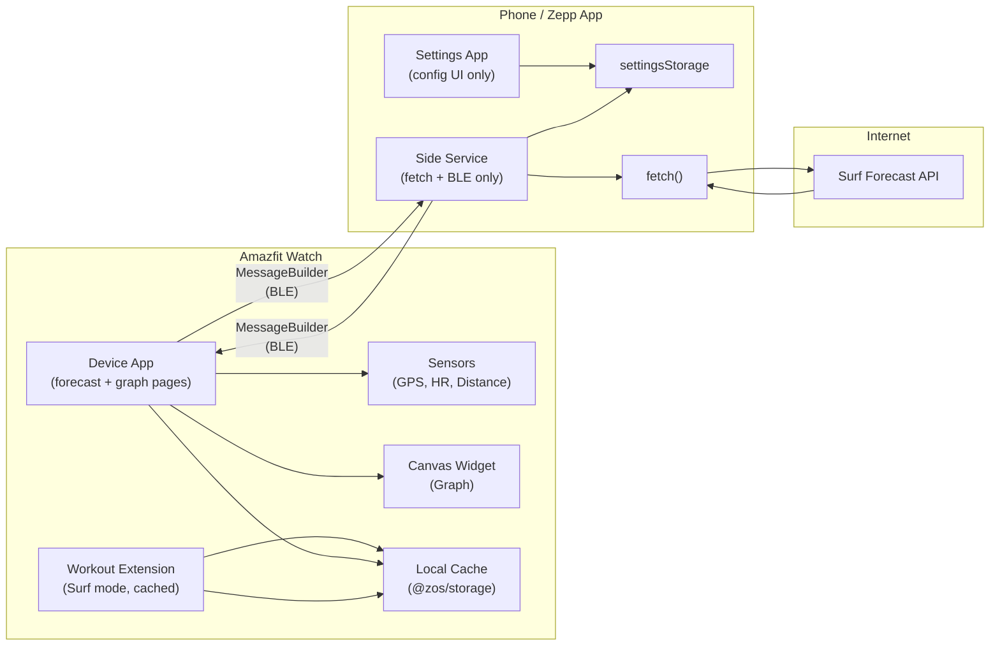
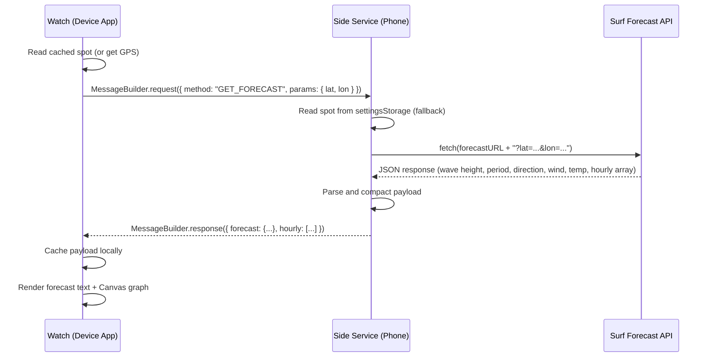
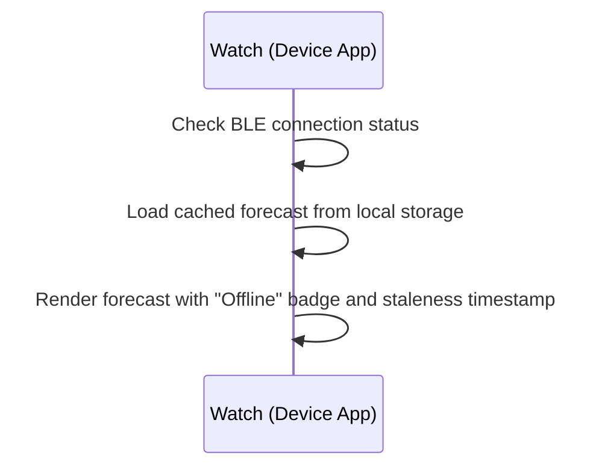
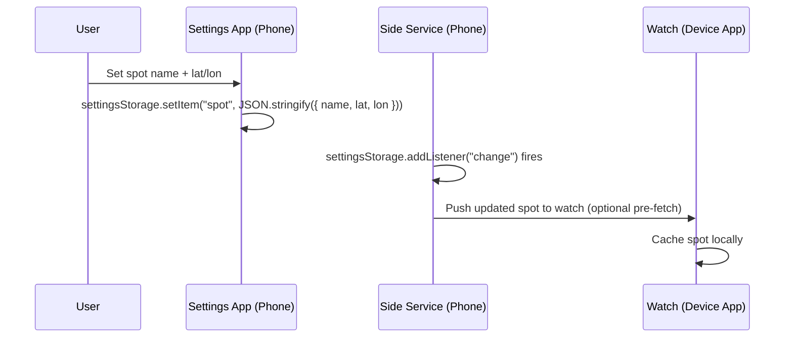

# Surf Forecast – Research Results and High-Level Design

## 1. Terminology (Official Zepp OS Terms)

Per the [Zepp OS Overall Architecture](https://docs.zepp.com/docs/guides/architecture/arc/), a complete **Mini Program** includes **Device App**, **Settings App**, and **Side Service**. Short definitions below; see [PRD §1](PRD.md#1-terminology-official-zepp-os-terms) for the full table.

- **Device App** — The part of the Mini Program that runs on the watch. It draws UI (widget API) and reads sensors. When the user taps the app icon, the Device App launches and shows its default page (first in `module.page.pages`). Our forecast and graph screens are Device App pages.
- **Workout Extension** — An optional module (configured via `data-widget` in app.json) that runs inside the system **Workout** app for a sport (e.g. Surfing). It displays cached forecast during a workout. API_LEVEL 3.6+.
- **Settings App** — Optional. Configuration UI for this Mini Program that runs **in the Zepp App** on the phone. User configures the app (e.g. surf spot) here. Uses `settingsStorage` only; **no Fetch API**; does not talk to the watch.
- **Side Service** — Optional. Runs in the Zepp App on the phone. No UI. **Only component that can do HTTP.** Fetches forecast, reads spot from `settingsStorage`, sends data to the Device App via BLE (MessageBuilder).
- **Regular (non-Zepp) Android app** — A separate APK. **Not used.** The watch only talks to the Zepp App (Side Service).

So: **Fetching** = Side Service only. **Phone ↔ watch** = Side Service only. **Showing forecast** = Device App (on the watch). We must split: Settings App = config UI; Side Service = fetch + send to watch.

---

## 2. Feasibility Summary

### Can the watch run this app standalone (without the phone)?

**Partially.** The table below breaks down each capability:

| Capability | Watch-only? | Why / Why not |
|------------|:-----------:|---------------|
| Display forecast UI + graph | Yes | Device App has full UI toolkit including Canvas for drawing graphs. |
| Fetch live forecast from the internet | **No** | Zepp OS has **no HTTP/fetch API on the device**. The `fetch` function exists only in the Side Service, which runs inside the Zepp App on the paired phone. The watch communicates with the phone over **Bluetooth Low Energy (BLE)** using the Messaging API / MessageBuilder. |
| Show cached (last synced) forecast | Yes | The Device App can persist data locally (`@zos/storage` or global state) and display it when offline. |
| Read GPS coordinates | Yes | `Geolocation` sensor from `@zos/sensor` runs on-device (permission `device:os.geolocation`). |
| Read heart rate | Yes | `HeartRate` sensor from `@zos/sensor` runs on-device (permission `data:user.hd.heart_rate`). |
| Read distance traveled | Yes | `Distance` sensor from `@zos/sensor` or `getSportData({ type: 'distance' })` from `@zos/app-access`. |
| Store user preferences (spot) | **No** (initial config) | `settingsStorage` lives in the Zepp App (phone). The Settings App UI also renders on the phone. Once synced to the watch, the spot can be cached locally. |

**Bottom line:** The watch can display data and read sensors autonomously, but it **cannot make network requests**. Any feature that needs internet (live forecast, spot lookup) requires the phone.

### Practical implications for the user

- **Typical use:** The surfer opens the app on the watch with the phone in a bag or pocket nearby. The forecast loads in a few seconds. They glance at the numbers and graph, then head out.
- **In the water:** The phone is likely left on shore. The watch shows the last synced forecast (cached). If v2 session tracking is enabled, sensors (BPM, GPS, distance) work independently.
- **Traveling (no pre-set spot):** The watch reads its GPS, sends coordinates to the Side Service, which fetches the forecast for that location. This requires the phone to be connected.

---

## 3. Architecture

### Component Diagram



- **Watch:** Device App pulls forecast via Side Service and caches it; Workout Extension only reads from cache (no BLE request from extension). Forecast is displayed only on the watch.
- **Phone:** Settings App = config UI (location); Side Service = HTTP fetch + BLE to Device App. No separate regular Android app in the loop.

### Project File Structure (after `zeus create`)

```
surf-forecast/
├── app.js                     # App lifecycle; init MessageBuilder + polyfill
├── app.json                   # App config (pages, data-widget for Workout Extension, etc.)
├── assets/
│   └── <device>/              # Per-device assets (icons, images)
├── pages/
│   ├── forecast/
│   │   └── index.js           # Standalone app: main forecast screen (text data)
│   ├── graph/
│   │   └── index.js            # Standalone app: Canvas-drawn wave graph
│   └── workout-extension/     # Workout Extension (Surf mode) – reads cache only
│       └── index.js
├── app-side/
│   └── index.js               # Side Service: fetch forecast, handle messages (only part that does HTTP)
├── setting/
│   └── index.js               # Settings App: spot picker UI (device application settings in Zepp App)
└── shared/
    ├── message.js             # MessageBuilder (device side)
    ├── message-side.js        # MessageBuilder (Side Service side)
    └── device-polyfill.js     # Polyfills required by message.js
```

In `app.json`, the Workout Extension is declared under `module.data-widget` with the appropriate sport type (e.g. Surf) and requires API_LEVEL 3.6+.

---

## 4. Data Flow

### Forecast Request (phone paired)



### Offline (phone not paired)



### Settings Flow



---

## 5. Key APIs and Permissions

### Device App (`@zos/*`)

| Module | Class / Function | Purpose | Permission |
|--------|-----------------|---------|------------|
| `@zos/sensor` | `Geolocation` | Get lat/lon from watch GPS | `device:os.geolocation` |
| `@zos/sensor` | `HeartRate` | Read BPM (v2 session) | `data:user.hd.heart_rate` |
| `@zos/sensor` | `Distance` | Read distance traveled (v2 session) | — |
| `@zos/ui` | `createWidget(widget.CANVAS, ...)` | Draw wave graph (drawLine, drawText, setPaint) | — |
| `@zos/ui` | `createWidget(widget.TEXT, ...)` | Display forecast numbers | — |
| `@zos/ble` | BLE send/receive | Low-level BLE (wrapped by MessageBuilder) | — |
| `@zos/app-access` | `getSportData` | Alternative distance/sport data (v2) | — |

### Side Service

| API | Purpose |
|-----|---------|
| `fetch(url, options)` | HTTP GET to surf forecast API |
| `messaging.peerSocket.send / addListener` | BLE communication with watch (or use MessageBuilder wrapper) |
| `settings.settingsStorage` | Read spot config set by Settings App; persist tokens/state |

### Settings App

| API | Purpose |
|-----|---------|
| `props.settingsStorage.setItem / getItem` | Save/load spot configuration |
| React-like render function (`Button`, `TextInput`, etc.) | Build the spot-picker UI |

### app.json Permissions Array

```json
{
  "permissions": [
    "device:os.geolocation",
    "data:user.hd.heart_rate"
  ]
}
```

(Heart rate permission only needed when v2 session features are implemented.)

---

## 6. Forecast API (Placeholder)

The specific API is TBD. Candidates:

| API | Free Tier | Coverage | Notes |
|-----|-----------|----------|-------|
| [Open-Meteo Marine](https://open-meteo.com/en/docs/marine-weather-api) | Unlimited (non-commercial) | Global | Wave height, period, direction. No API key required. |
| [Storm Glass](https://stormglass.io/) | 50 req/day | Global | Comprehensive (swell, wind, tide, water temp). Requires API key. |
| [Surfline (unofficial)](https://github.com/swrobel/meta-surf-forecast) | Varies | Popular spots | Scraped; not stable. |

### Placeholder Payload Shape

The Side Service should normalize any API response into this shape before sending to the watch:

```json
{
  "spot": "Pipeline, North Shore",
  "updatedAt": 1710764400,
  "current": {
    "waveHeight": 1.8,
    "wavePeriod": 12,
    "waveDirection": 315,
    "windSpeed": 15,
    "windDirection": 45,
    "waterTemp": 24
  },
  "hourly": [
    { "time": 1710720000, "waveHeight": 1.2, "score": 6 },
    { "time": 1710723600, "waveHeight": 1.5, "score": 7 },
    { "time": 1710727200, "waveHeight": 1.8, "score": 8 }
  ]
}
```

The `score` field is a placeholder composite (0-10) computed by the Side Service from wave height, period, wind, etc.

---

## 7. Canvas Graph Design Notes

The watch Canvas widget supports:

- `setPaint({ color, line_width })` — set stroke style.
- `drawLine({ x1, y1, x2, y2 })` — draw line segments (connect hourly data points).
- `drawText({ x, y, text, text_size })` — axis labels, values.
- `drawRect` / `drawRectFill` — background, bars.
- `clear({})` — wipe and redraw.

**Graph layout (conceptual for a ~480px round screen):**

```
 ┌────────────────────────┐
 │  Wave Height (m)       │  <- title (drawText)
 │ 2.0 ─ ─ ─ ─ ─ ─ ─ ─ ─│  <- Y-axis gridline
 │      ╱╲                │
 │ 1.0 ╱  ╲    ╱╲        │  <- data line (drawLine segments)
 │    ╱    ╲  ╱  ╲       │
 │ 0.0─────╲╱────╲───────│  <- X-axis
 │   6am  9am 12pm 3pm   │  <- time labels (drawText)
 │         ▲ now          │  <- "now" marker
 └────────────────────────┘
```

The `hourly` array from the forecast payload maps directly to data points. X is computed as `(time - startTime) / totalSpan * graphWidth`, Y is `graphHeight - (waveHeight / maxHeight * graphHeight)`.

---

## 8. Watch-Only vs Paired Feature Matrix

| Feature | Watch-Only | Paired (Phone) | Notes |
|---------|:----------:|:--------------:|-------|
| Forecast text display | Cached only | Live | Cached data shown with staleness badge |
| Forecast graph | Cached only | Live | Same Canvas rendering; different data freshness |
| Spot configuration | Use cached spot | Full Settings UI | User must have configured once while paired |
| GPS-based forecast | Read GPS only (no fetch) | GPS + fetch | Watch gets coords; phone fetches for that location |
| Heart rate (v2) | Yes | Yes | Fully on-device |
| Distance (v2) | Yes | Yes | Fully on-device |
| Session recording (v2) | Yes (local) | Yes (local + sync) | Data stored on watch; sync to phone when paired |

---

## 9. Risk Assessment

| Risk | Impact | Mitigation |
|------|--------|------------|
| Forecast API rate limits | Cannot refresh data | Cache aggressively; refresh only on app open; choose API with generous free tier (Open-Meteo). |
| BLE disconnects mid-fetch | Partial / no data | Timeout handling in MessageBuilder; fall back to cache. |
| Canvas performance on older devices | Slow graph rendering | Keep data points to 24-48 max; avoid complex shapes. |
| API response too large for BLE message | Transmission failure | Compact payload on Side Service; send only essential fields; chunk if needed. |
| User never configures spot | App shows nothing | Default to GPS-based location on first launch (requires phone); show "Set your spot" prompt. |

---

## 10. Implementation Phases

### Phase 1 (MVP)

1. Scaffold project with `zeus create surf-forecast` (APP + app-side + settings).
2. Implement Side Service (only component that does HTTP): fetch from Open-Meteo Marine API, normalize payload; read spot from settingsStorage.
3. Implement standalone Device App: forecast page and graph page; receive payload via MessageBuilder, display text and Canvas graph.
4. Implement Settings App (device application settings in Zepp App): spot name + lat/lon input, save to settingsStorage. No fetch, no watch communication.
5. Offline cache: store last payload on watch; standalone app shows staleness when offline.
6. Workout Extension (API_LEVEL 3.6+): register in app.json `data-widget` for Surf (or relevant) sport; extension page reads cached forecast only and shows compact view during workout.

### Phase 2 (Session Tracking)

1. Add HeartRate + Distance sensor reads on a "Session" page.
2. Add GPS tracking during a session.
3. Session summary screen (avg/max BPM, total distance, duration).
4. Persist session data on device; optional sync to phone.

### Phase 3 (Polish)

1. Multiple saved spots with watch-side switching.
2. Notifications: "Waves are firing at your spot right now."
3. Refined scoring algorithm with user-tunable weights.
4. Tide chart overlay on graph.

---

## 11. References

| Resource | URL |
|----------|-----|
| Zepp OS Quick Start | https://docs.zepp.com/docs/guides/quick-start/ |
| Zeus CLI | https://docs.zepp.com/docs/guides/tools/cli/ |
| app.json Reference | https://docs.zepp.com/docs/reference/app-json/ |
| Zepp OS Overall Architecture | https://docs.zepp.com/docs/guides/architecture/arc/ |
| Side Service Introduction | https://docs.zepp.com/docs/guides/framework/side-service/intro/ |
| Bluetooth Communication Guide | https://docs.zepp.com/docs/guides/best-practice/bluetooth-communication/ |
| Fetch API Sample | https://docs.zepp.com/docs/samples/app/fetchAPI/ |
| Geolocation Sensor | https://docs.zepp.com/docs/reference/device-app-api/newAPI/sensor/Geolocation/ |
| HeartRate Sensor | https://docs.zepp.com/docs/reference/device-app-api/newAPI/sensor/HeartRate/ |
| Distance Sensor | https://docs.zepp.com/docs/reference/device-app-api/newAPI/sensor/Distance/ |
| Canvas Widget | https://docs.zepp.com/docs/reference/device-app-api/newAPI/ui/widget/CANVAS/ |
| Settings Storage API | https://docs.zepp.com/docs/reference/side-service-api/settings-storage/ |
| Messaging API | https://docs.zepp.com/docs/reference/side-service-api/messaging/ |
| Open-Meteo Marine API | https://open-meteo.com/en/docs/marine-weather-api |
| Context7 Zepp OS Docs | Library ID `/zepp-health/zeppos-docs` (3400+ snippets) |
